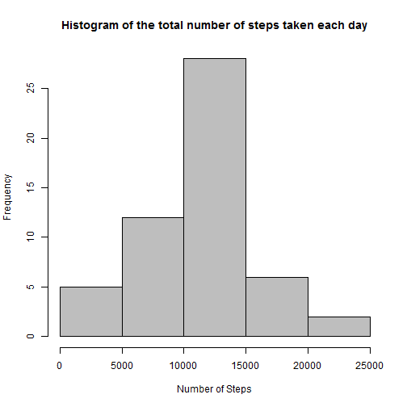
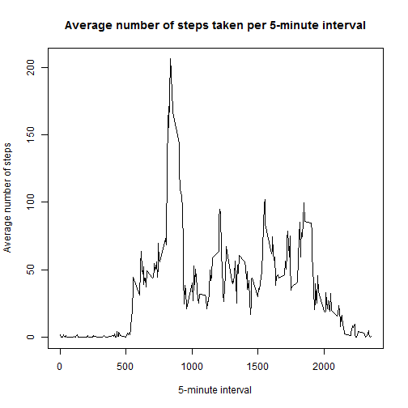
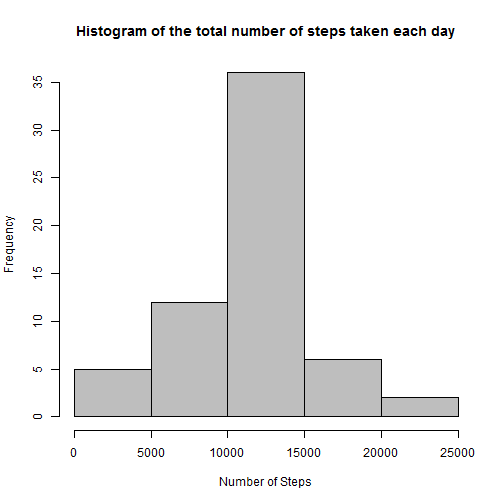
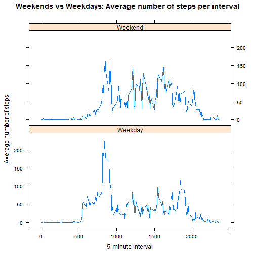

Reproducible Research Course - Peer Assessment 1
====================================================================================


The purpose of this assignment is to answer some questions about a data collected from a personal activity monitoring device such as Fitbit, Nike Fuelband or Jawbone Up. The device collects data at 5 minute intervals through out the day. The data consists of two months of data from an anonymous individual collected during the months of October and November, 2012 and include the number of steps taken in 5 minute intervals each day.
The answers are reported in this file generated by R markdown document using knitr process.

### Loading and preprocessing the data

* Load the data (i.e. read.csv())

* Process/transform the data (if necessary) into a format suitable for your analysis


```r
# set working directory to the one where is data set file
#setwd("<datasetdirectory>")
activitydata <- read.csv("activity.csv", header=TRUE)
activitydata$date <- as.Date(activitydata$date)
head(activitydata)
```

```
##   steps       date interval
## 1    NA 2012-10-01        0
## 2    NA 2012-10-01        5
## 3    NA 2012-10-01       10
## 4    NA 2012-10-01       15
## 5    NA 2012-10-01       20
## 6    NA 2012-10-01       25
```

### Question 1 - What is the mean total number of steps taken per day?

* Calculate the total number of steps taken per day (ignore the missing values in the dataset)


```r
numberStepsPerDay <- aggregate(steps ~ date, data = activitydata, FUN = sum, na.rm=T)
```

* Make a histogram of the total number of steps taken each day


```r
hist(numberStepsPerDay$steps, main = "Histogram of the total number of steps taken each day", 
     col = "gray", xlab="Number of Steps")
```

 

* Calculate and report the mean and median of the total number of steps taken per day


```r
meanvalue <- mean(numberStepsPerDay$steps, na.rm=T)
print(meanvalue)
```

```
## [1] 10766.19
```

```r
median(numberStepsPerDay$steps, na.rm=T)
```

```
## [1] 10765
```

#### Answer: The mean of total number of steps taken per day is 1.0766189 &times; 10<sup>4</sup>

### Question 2 - What is the average daily activity pattern?

* Make a time series plot (i.e. type = "l") of the 5-minute interval (x-axis) and the average number of steps taken, averaged across all days (y-axis)


```r
averageSteps <-  tapply(activitydata$steps, activitydata$interval, mean, na.rm = TRUE)
plot(row.names(averageSteps), averageSteps, type='l', col=1, 
     main="Average number of steps taken per 5-minute interval", 
     xlab="5-minute interval", 
     ylab="Average number of steps")
```

 

* Which 5-minute interval, on average across all the days in the dataset, contains the maximum number of steps?


```r
maximumSteps <- names(which.max(averageSteps))
print(maximumSteps)
```

```
## [1] "835"
```

#### Answer: The 835 minute interval contains the maximum number of steps

### Inputing missing values

* Calculate and report the total number of missing values in the dataset (i.e. the total number of rows with NAs)


```r
sum(!complete.cases(activitydata))
```

```
## [1] 2304
```

* Devise a strategy for filling in all of the missing values in the dataset. The strategy does not need to be sophisticated. For example, you could use the mean/median for that day, or the mean for that 5-minute interval, etc.
  
  Create a vector "newSteps" completing NA values with the average steps for 5-minute interval
  

```r
meanStepsbyInterval <- aggregate(steps ~ interval, data = activitydata, FUN = mean)
newSteps <- numeric() 
for (i in 1:nrow(activitydata))
{
    if (is.na(activitydata$steps[i]))
    {
        tmp <- subset(meanStepsbyInterval, interval == activitydata$interval[i])$steps     
    } else
    {
        tmp <- activitydata$steps[i]    
    }
    newSteps <- rbind(newSteps, tmp)
}
newSteps <- as.numeric(newSteps)
```

* Create a new dataset that is equal to the original dataset but with the missing data filled in.


```r
newdataset <- activitydata
newdataset$steps <- newSteps
head(newdataset)
```

```
##       steps       date interval
## 1 1.7169811 2012-10-01        0
## 2 0.3396226 2012-10-01        5
## 3 0.1320755 2012-10-01       10
## 4 0.1509434 2012-10-01       15
## 5 0.0754717 2012-10-01       20
## 6 2.0943396 2012-10-01       25
```

* Make a histogram of the total number of steps taken each day and Calculate and report the mean and median total number of steps taken per day. Do these values differ from the estimates from the first part of the assignment? What is the impact of imputing missing data on the estimates of the total daily number of steps?


```r
newNumberStepsPerDay <- aggregate(steps ~ date, data = newdataset, FUN = sum)
hist(newNumberStepsPerDay$steps, 
     main = "Histogram of the total number of steps taken each day", 
     col = "gray", xlab="Number of Steps")
```

 

```r
mean(newNumberStepsPerDay$steps, na.rm=T)
```

```
## [1] 10766.19
```

```r
median(newNumberStepsPerDay$steps, na.rm=T)
```

```
## [1] 10766.19
```
#### Answer: Completing the NA values with the average number of steps per 5-minute interval, the mean and median values are the same (1.0766189 &times; 10<sup>4</sup>). As an impact of inputing missing data, the total daily number of steps increases.

### Question 3 - Are there differences in activity patterns between weekdays and weekends?

* Create a new factor variable in the dataset with two levels - "weekday" and "weekend" indicating whether a given date is a weekday or weekend day.


```r
day <- vector(length=nrow(newdataset))
day[!weekdays(newdataset$date, abb=T) %in% c("Sat", "Sun")] <- "Weekday"
day[weekdays(newdataset$date, abb=T) %in% c("Sat", "Sun")] <- "Weekend"
newdataset <- cbind(newdataset, day)
```

* Make a panel plot containing a time series plot (i.e. type = "l") of the 5-minute interval (x-axis) and the average number of steps taken, averaged across all weekday days or weekend days (y-axis). See the README file in the GitHub repository to see an example of what this plot should look like using simulated data.


```r
newMeanStepsbyInterval <- aggregate(steps ~ interval + day, data = newdataset, FUN = mean)
names(newMeanStepsbyInterval) <- c("interval", "day", "steps")
library(lattice)
xyplot(steps ~ interval | day, newMeanStepsbyInterval, type = "l", layout = c(1, 2),
       xlab = "5-minute interval", ylab = "Average number of steps",
       main = "Weekends vs Weekdays: Average number of steps per interval")
```

 

#### Answer: The average number of steps per 5-minute interval during weekends is higher than during weekdays. 
